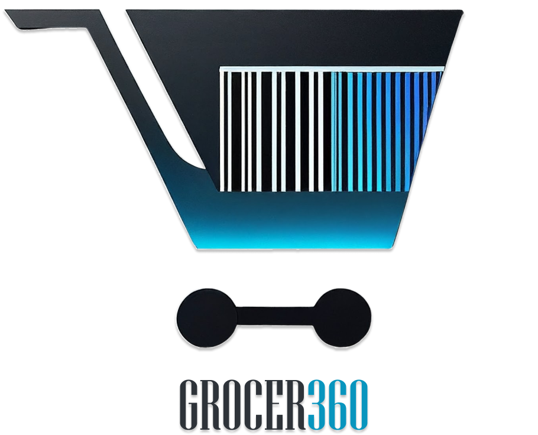

# Grocery Management System

 

## Overview

This comprehensive grocery management system is designed to empower grocery store owners and employees with efficient tools to manage their operations effectively. It offers features such as detailed product information, sales data visualization, report generation, and secure employee access through face recognition. 

## Key Features

- **Detailed Product Information:**
    - Maintain an up-to-date catalog with comprehensive details on each product.
    - Easy access to information for both owners and employees.
- **Sales Data Visualization:**
    - Gain valuable insights into sales trends and performance.
    - Make data-driven decisions with intuitive visualizations.
- **Report Generation:**
    - Automate the creation of sales reports for various time periods.
    - Streamline analysis and planning with readily available reports.
- **Secure Employee Access:**
    - Utilize face recognition technology for secure and convenient login.
    - Enhance store security and improve operational efficiency.

## Problem Domain

This system addresses the following common challenges faced by grocery stores:

- **Inefficient inventory management:** The system provides a centralized platform for tracking and managing inventory, minimizing errors and stockouts.
- **Limited access to sales data:** Sales data visualization and reporting features enable store owners to analyze performance and identify areas for improvement.
- **Insecure employee access:** Face recognition technology offers a more secure and streamlined login process compared to traditional methods.

## Benefits

- **Improved efficiency:** Streamline various aspects of grocery store operations.
- **Enhanced data accuracy:** Ensure accurate and up-to-date product and sales information.
- **Informed decision-making:** Utilize sales data and reports to make strategic business decisions.
- **Increased security:** Protect store assets and information with secure employee access.
- **Cost savings:** Optimize inventory management and reduce losses due to errors or theft.

## Technology Stack

- **Programming Languages:** Python
- **Frameworks:** `customtkinter` for GUI
- **Libraries:** `face_recognition`, `opencv-python`, `dlib`
- **Database:** postgreSQL
- **Other Tools:** CSV for receipt management

## Installation & Setup

### 1. Project Setup and Dependencies

1. Clone the project repository to your local machine:
    ```bash
    git clone <repository-url>
    ```
2. Navigate to the project's root directory:
    ```bash
    cd <project-directory>
    ```
3. Install the required dependencies using the provided `requirements.txt` file:
    ```bash
    pip install -r requirements.txt
    ```

### 2. Prerequisites

- **Python:** Ensure you have Python 3.7 or higher installed. You can download it from [python.org](https://www.python.org/).
- **Package Manager:** We recommend using `pip` to manage Python packages.

### 3. Additional Steps

- **Camera Access:** If you're using a webcam for face recognition, ensure your camera is connected and working properly.
- **Training Data:** You'll need a set of images for each employee you want the system to recognize. These images should be organized into separate folders, with the folder name being the employee's name.
- **Configuration:** Update the system's configuration file to point to the location of your training data.

### Troubleshooting

- **Installation Issues:** If you encounter issues installing any of the packages, make sure you have the latest version of `pip`. You can upgrade it using:
    ```bash
    pip install --upgrade pip
    ```
- **Face Detection Accuracy:** If the face recognition accuracy is not satisfactory, you might need to adjust the settings in the `face_recognition` library or provide more training data.

## Usage

### 1. Launching the Application

To start the grocery management system, navigate to the project's root directory and run the main application script:
```bash
python main.py
```

### 2. User Authentication

- **Login:** Employees can log in using the face recognition feature. The system will prompt them to look into the webcam for authentication.
- **Role-Based Access:** Depending on the employee's role (e.g., cashier, manager), different features and functionalities will be accessible.

### 3. Managing Products

- **Add New Products:** Use the "Add Product" feature to input new items into the system, including details such as name, price, category, and stock quantity.
- **Update Product Information:** Edit existing product details to keep the inventory up-to-date.
- **Remove Products:** Delete products that are no longer available.

### 4. Sales and Reporting

- **Process Sales:** Use the sales interface to scan items, calculate totals, and generate receipts.
- **Generate Reports:** Access sales reports for daily, weekly, monthly, or custom time periods. Use these reports to analyze sales trends and make informed decisions.

### 5. Inventory Management

- **Track Inventory:** Monitor stock levels and receive alerts for low-stock items.
- **Order Management:** Create and manage purchase orders to restock inventory.

## Video Tutorial

For additional help with the installation, especially for the `dlib` library, watch this video tutorial:

[](https://www.youtube.com/watch?v=pO150OCX-ac)

## Contributing

We welcome contributions to the Grocery Management System! If you'd like to contribute, please follow these steps:

1. Fork the repository.
2. Create a new branch (`git checkout -b feature/YourFeature`).
3. Commit your changes (`git commit -m 'Add your feature'`).
4. Push to the branch (`git push origin feature/YourFeature`).
5. Open a Pull Request.

----

## for the task


# Grocery

## wire-frames


## splash-screen


## welcomePage


---

## adminPae


---

## sellerpage

